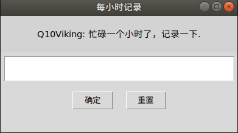
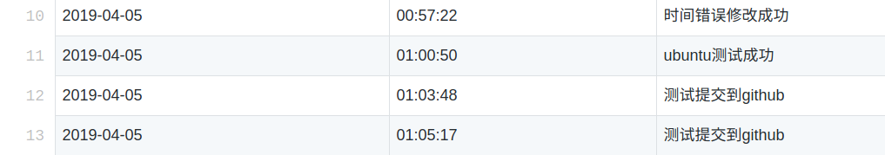

# HourLog

> 在电脑上工作一小时，记录自己的所感所想，一些小总结



1. 填入记录以后，信息会上传到github上
2. 数据形式以: **日期**，**时间**，**记录**，存储在csv文件中，每个月存储一个csv文件

3. 运行两分钟会自动关闭


## 环境支持

1. python3 [Youtube-video: 安装python3的视频](https://www.youtube.com/watch?v=V_ACbv4329E)

```python
#python 安装的位置
C:\Users\Q10Viking> python -c "import sys; print(sys.executable)"
C:\python37\python.exe
```

## 如何运行该程序

> python App.py

## ubuntu下定时执行

1. 在自己的HOME目录下创建一个文件，如**hzzcron**,写入定时计划如下


> 每在一小时的0分弹出窗口

```
0 */1 * * * export DISPLAY=:0 && cd /home/hzz/Desktop/github/HourLog && /usr/bin/python3 APP.py 

```

2. 加入到crontab中

> crontab hzzcon

3. 查看任务

> crontab -l

4. 删除任务

> crontab -r


## crontab格式

[测试网站](https://crontab.guru/)

